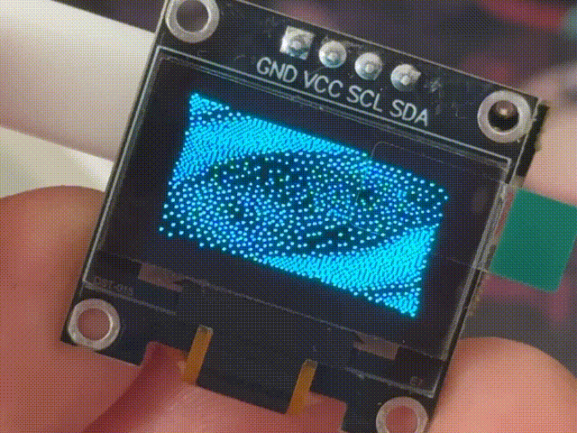
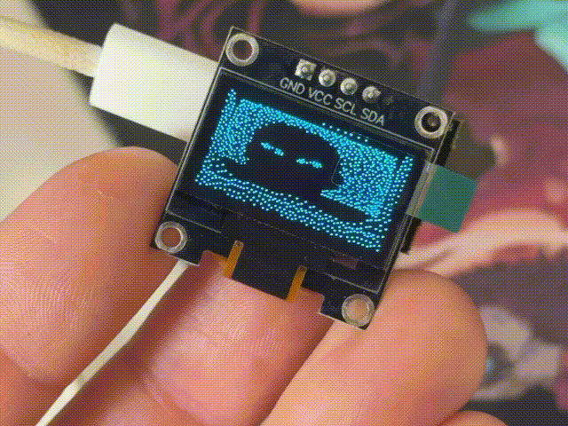
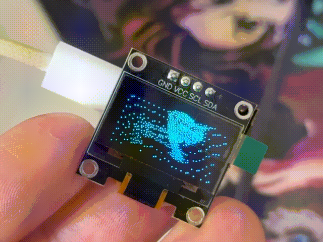

# ESP32 OLED GIF Generator

A Python GUI utility to convert GIF animations into Arduino C code for ESP32 and SSD1306 OLED displays (128x64 B&W). 

## Features
* **Easy to use GUI** with support for English, Spanish, and Russian languages.
* **Automatic image processing:** resizes GIFs to 128x64 and applies Black & White dithering.
* **Custom I2C Pins:** Easily configure SDA and SCL pins directly in the app.
* **Instant Preview:** View how the animation will look on the OLED display before generating the code.
* **One-Click Code Generation:** Generates a ready-to-compile `.ino` sketch for the Arduino IDE.

## Requirements
To run the Python script, you need the `Pillow` library:

    pip install Pillow

To upload the generated code to your ESP32, you will need the following Arduino libraries:
* `Adafruit GFX Library`
* `Adafruit SSD1306`

## How to Run
* **Windows:** Simply double-click the included `run.bat` file.
* **Manual run:** Open your terminal/command prompt and execute:

    python gui_generator.py

## Examples & Sample Files

This repository includes pre-generated `.ino` firmware examples and their corresponding source GIFs. 

### Mini universe spinning

*Ready-to-flash sketch: `uni.ino`*

### Guy climbing into the screen

*Ready-to-flash sketch: `tv.ino`*

### Cat walking

*Ready-to-flash sketch: `cat.ino`*
